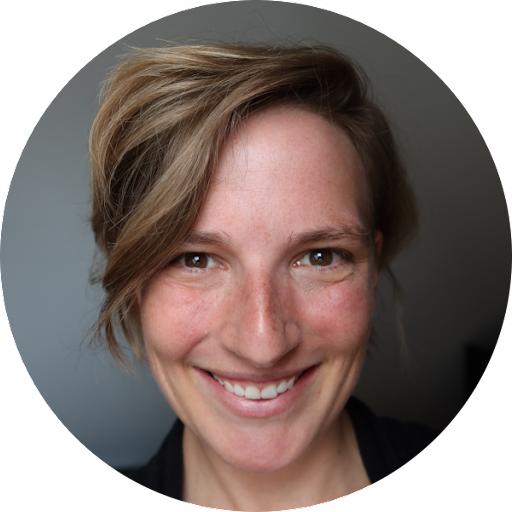

Wir sind ein Team aus Data Scientists und Statistiker:innen. Unser Ziel ist es, dazu beizutragen, dass Daten in der öffentlichen Verwaltung effektiver genutzt werden. <!--more--> Wir wollen Beschäftigte im öffentlichen Sektor zum (besseren) Umgang mit Daten befähigen, die Datenkompetenz stärken, und so zur verstärkten Umsetzung von Datenprojekten beitragen. Anhand von konkreten Beispielen aus der Verwaltungspraxis möchten wir Digitalisierung greifbar und interaktiv erlebbar machen.

### Prof. Dr. Frauke Kreuter

<table class="fixed">
	<col width=50% />
    <col width=50% />
  <tr>
    <td style="text-align:right"> </td>
    <td>Frauke Kreuter ist Inhaberin des Lehrstuhls für Statistik und Datenwissenschaft an der LMU München, und an der University of Maryland, USA, ist sie Co-Direktorin des Social Data Science Center (SoDa) und Fakultätsmitglied im Joint Program in Survey Methodology (JPSM). Sie ist eine gewählte Fellow der American Statistical Association und erhielt 2020 den Warren Mitofsky Innovators Award der American Association for Public Opinion Research. Neben ihrer akademischen Arbeit ist Frauke Kreuter Gründerin des International Program for Survey and Data Science (IPSDS), das als Reaktion auf die steigende Nachfrage von Forscher:innen und Parktiker:innen nach geeigneten Methoden und Instrumenten für ein sich veränderndes Datenumfeld entwickelt wurde. Sie ist außerdem Mitbegründerin der Coleridge Initiative, deren Ziel es ist, datengestützte Forschung und Politik rund um den Menschen und seine Interaktionen für Programmmanagement, Politikentwicklung und wissenschaftliche Zwecke zu beschleunigen, indem ein effizienter, effektiver und sicherer Zugang zu sensiblen Daten über Gesellschaft und Wirtschaft ermöglicht wird; und Mitbegründerin des deutschsprachigen Podcasts Dig Deep.
</td>
   </tr> 
</table>

### Dr. Heidi Seibold

<table class="fixed">
	<col width=50% />
  <col width=50% />
  <tr>
  	<td>Heidi Seibold ist Trainerin und Beraterin für Open and Reproducible Research und unabhängige Wissenschaftlerin bei IGDORE. Sie ist eine Co-Gründerin von Open Science Freelancers. Ihre Forschung liegt in der Schnittmenge von Datenwissenschaft, Reproduzierbarkeit und Medizin. Heidi Seibold hat Statistik studiert und in Biostatistik mit einem Schwerpunkt auf maschinellem Lernen promoviert. In ihrem Podcast "reboot academia" und ihrem beliebten Newsletter spricht sie über Open Science, gute Wissenschaft und die Zukunft der Forschung. </td>
    <td style="text-align:center"> </td>
   </tr> 
</table>

### Dr. Malte Schierholz

<table class="fixed">
	<col width=50% />
     <col width=50% />
  <tr>
  	<td style="text-align:center"> </td>
  	<td>Malte Schierholz ist Postdoktorand am Lehrstuhl für Statistik und Data Science für die Sozial- und Geisteswissenschaften an der Ludwig-Maximilians-Universität München. Er ist Teil des nationalen Forschungsdateninfrastruktur Projekts BERD@NFDI, wo er Schulungen für Sozialwissenschaftler:innen entwirft, die unstrukturierte (große) Daten wie Bilder und Textdaten für ihre Analysen nutzen wollen. Ein übergreifendes Thema von Malte Schierholz' Arbeit ist, dass er gerne darüber nachdenkt, wie Sozialwissenschaftler:innen die Versprechen und Vorteile des maschinellen Lernens am besten nutzen können.</td>
    
   </tr> 
</table>

### Dr. Marcel Neunhoeffer

<table class="fixed">
	<col width=50% />
     <col width=50% />
  <tr>
  	<td>Marcel Neunhoeffer ist Postdoktorand am Lehrstuhl für Statistik und Data Science für die Sozial- und Geisteswissenschaften an der Ludwig-Maximilians-Universität München. Er forscht an der Schnittstelle von Sozialwissenschaften und Informatik. Marcel Neunhoeffer interessiert sich insbesondere für die Anwendung von Deep-Learning-Algorithmen auf sozialwissenschaftliche Problemstellungen. Sein Fokus liegt dabei auf dem Einsatz von synthetischen Daten und differential privacy um Datenanalyse und Datenschutz auszubalancieren. Darüber hinaus ist Marcel Neunhoeffer Mitbegründer, Mitwirkender und Visualisierer von zweitstimme.org - einer Website, die eine wissenschaftliche Prognose zur Bundestagswahl einem breiten Publikum vermittelt.
    </td>
    <td style="text-align:center"> </td>
   </tr> 
</table>

### Felix Henninger

<table class="fixed">
   <col width=50% />
   <col width=50% />
   <tr>
      <td style="text-align:center">
         
      </td>
      <td>
         <a href="https://felixhenninger.com">Felix Henninger</a> ist wissenschaftlicher Mitarbeiter und Softwareentwickler am Lehrstuhl für Statistik und Data Science für die Sozial- und Geisteswissenschaften an der Ludwig-Maximilians-Universität München. Sein Ziel ist es, fortgeschrittene Methoden der Datenerfassung und -analyse für Forscher:innen und Praktiker:innen zugänglich zu machen.
      </td>
   </tr>
</table>

